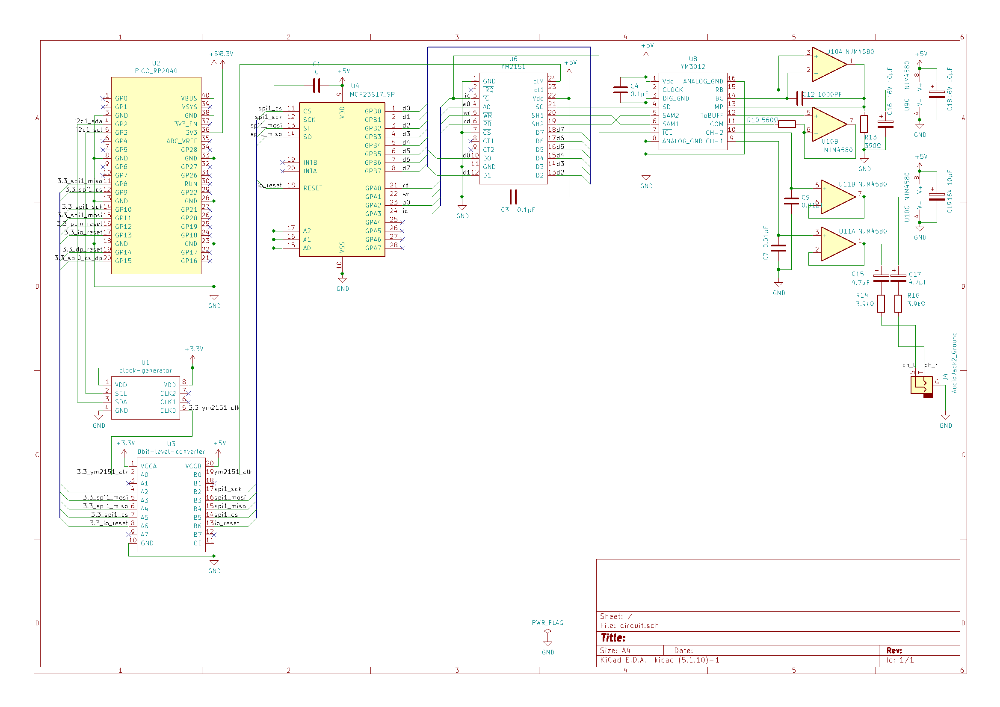

# PHP YM2151 player

Playing YM2151 with PHP.

[](https://www.youtube.com/watch?v=CBj7pt_eB0Y)  
https://www.youtube.com/watch?v=CBj7pt_eB0Y

## Requiements

### Software

* Raspberry Pi 3
  * Also works on devices supported by calcinai/phpi.
* PHP >= 7.3
* composer
* [optional] calcinai/php-ext-mmap (strongly recommended)

### Hardware

* YM2151 & YM3012
* Clock generator: Si5351A
  * https://akizukidenshi.com/catalog/g/gK-10679/
  * Or 4MHz clock oscillator
* 8bit level converter: FXMA108
  * https://akizukidenshi.com/catalog/g/gM-04522/
  * Or another 5V to 3.3V converter
* MCP23S17
* NJM4580 or another amp

#### Circuit diagram



|Pi3|RP2040 in circuit above|
|------|---|
|1: 3V3 power|36: 3V3|
|2: 5V power|40: VBUS|
|3: GPIO 2 (SDA)|4: GP2 (i2c1_sda)|
|5: GPIO 3 (SCL)|5: GP3 (i2c1_scl)|
|6: Ground|38: Ground|
|11: GPIO17|17: GP13|
|19: GPIO 10 (MOSI)|15: GP11 (3.3_spi1_mosi)|
|21: GPIO 9 (MISO)|11: GP8 (3.3_spi1_miso)|
|23: GPIO 11 (SCLK)|14: GP10 (3.3_spi1_sck)|
|24: GPIO 8 (CE0)|12: GP9 (3.3_spi1_cs)|

## Install

```shell
$ git clone https://github.com/hasegawa-tomoki/php-ym2151-player
$ cd php-ym2151-player
$ composer install
```

## Run

```shell
$ sudo php play.php your-vgm-file.vgm
```

## Thanks/Refs

* [h1romas4/arduino-vgmplayer](https://github.com/h1romas4/arduino-vgmplayer)
* [h1romas4/esp32-genesis-player](https://github.com/h1romas4/esp32-genesis-player)
* [calcinai/phpi](https://github.com/calcinai/phpi)
* [calcinai/php-ext-mmap](https://github.com/calcinai/php-ext-mmap)
* [VGM Specification](https://vgmrips.net/wiki/VGM_Specification)  
* [Si5351Aの実験その２（任意の周波数の発生）](http://jh7ubc.web.fc2.com/arduino/Si5351A_2.html)
* [petrockblog/RPi-MCP23S17](https://github.com/petrockblog/RPi-MCP23S17)
